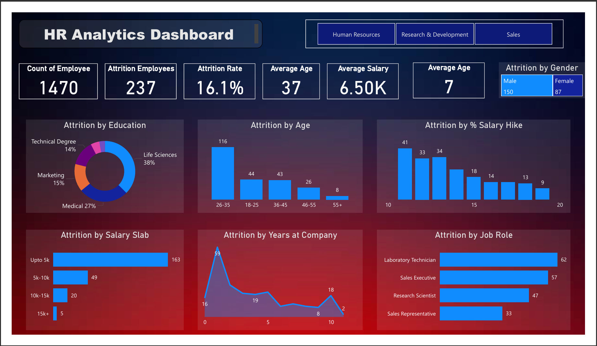

# HR Analytics Dashboard (Power BI)

## 📌 Project Overview
This project analyzes HR employee data to identify patterns of attrition.  
Built an interactive Power BI dashboard to highlight key insights for HR decision-making.

## 📊 Dashboard Features
- Total Employees, Attrition Count, Attrition Rate, Average Age, Average Salary
- Attrition by Gender, Age Group, Education, Job Role, Salary Slab
- Attrition trends by Years at Company and % Salary Hike
- Department-level slicers for deeper analysis

## 🛠 Tools Used
- Power BI
- MS Excel

## 📷 Dashboard Preview

## 🚀 Key Insights from the Dashboard

- **Attrition Rate:** 16.1% (237 employees left out of 1470 total).  
- **Department Impact:** Research & Development saw the highest attrition with **133 employees** leaving.  
- **Age Trends:** Employees aged **26–35** showed the highest attrition, with attrition decreasing as age increases.  
- **Compensation:** Most employees leaving had a monthly salary **below 5K**, while the company’s average salary was **6.5K**.
- **Salary Hike:** Employees receiving salary hikes below **15%** had a significantly higher likelihood of attrition.  
- **Tenure:** Attrition was highest among employees with **1–3 years** of service, highlighting early-career exits.  
- **Job Roles:** The roles most affected by attrition were **Laboratory Technicians, Sales Executives, Research Scientists, and Sales Representatives**.  

---
